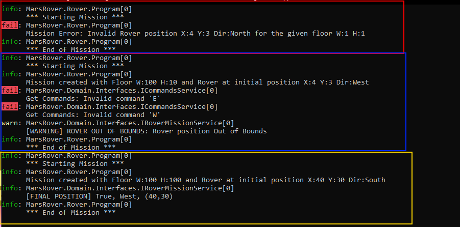

# Mars Rover
**Luiz Felipe Mandetta Clementino**

## Stack used
- Dotnet Core 3.1
- xUnit

## How to run
Just type on the command line: 

        dotnet run

## Description
The objective of this program is to create and validate commands for a Rover to move in a square floor on Mars. The Rover accepts three type of commands: 
- Advance (A)
- Turn Left (L)
- Turn Right (R)

The square floor has two attributes, the width (W) and height (H).

To start a simulation, the user should provide the size of the square floor with width (W) and height (H) and the initial position of the Rover inside that area. It should come with the (X) and (Y) coordinates and the inital direction of the Rover, (N)orth, (W)est, (S)outh or (E)ast.

To move the Rover, the user should also provide a set of commands in one string with the movements. 

Example: 

    AALRAR -> this is a set of commands for the Rover to (A)advance, (A)advance, Turn (L)eft, Turn (R)ight, (A)advance and Turn (R)ight.

> Any char different from those three will be **ignored** and it is not case sensitive.

## Checks
The application makes some checks to ensure everything that is part of the Mission is valid.

- Fist it checks if the Rovers's inital coordinate is inside the square floor created. If not, it returns an ***error*** message.
  

- Then it checks if the movements are valid in keeping the Rover inside the square floor. Otherwise it will return an ***error*** message.

## Example

In this image there are 3 cases:

- The first on is an error when the Rover's initial position is outside the square floor. Otherwise
- The second is a warning when the given commands will make the Rover goes out of the defined bounds.
- The third is a successfully case and it shows an info message with the last position of the Rover as requested.

## How to test?

The solution has its own Unit Tests developed using _xUnit_ library.

It can be tested through command line by typing:

        dotnet test

## Architecture
  
- Rover layer: This will have the main program and the Rover instructions.
- Domain layer: This layer have the domain core, Models, Interfaces and Services.
- Test project: Application and Domain layers tested to ensure quality.